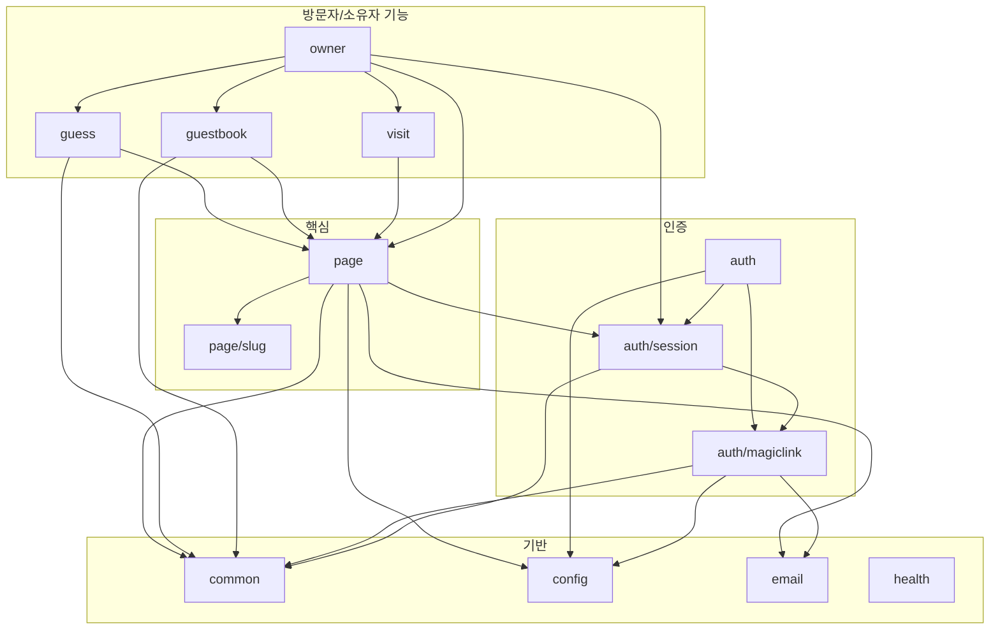
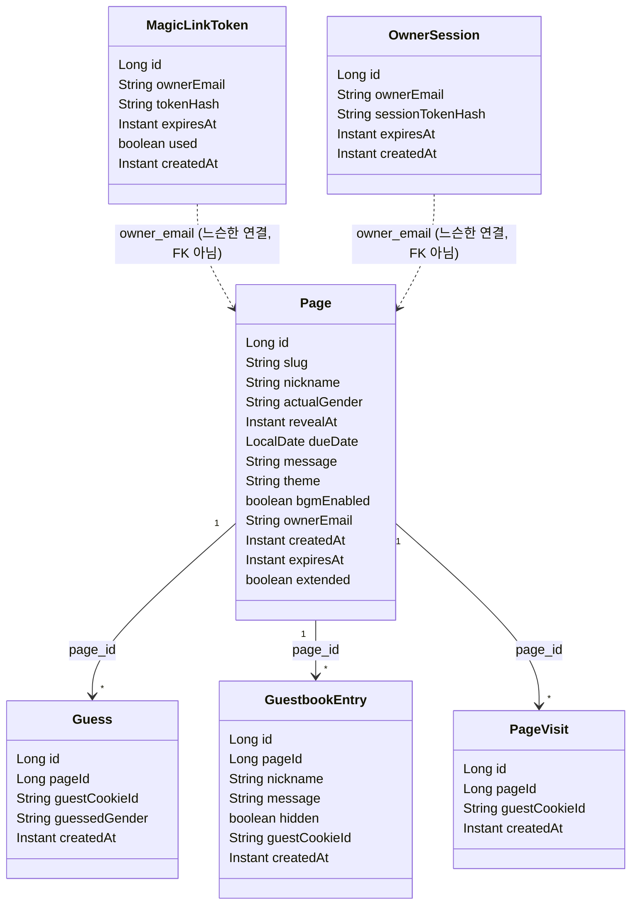

# 젠더리빌 API (`api/`)

Spring Boot 백엔드. 도메인별 패키지(package-by-feature)로 구성돼 있고, 패키지 하나가
너무 커지면(파일 15개 안팎) 그 안에서 독립적으로 떼어낼 수 있는 하위 기능만
하위 패키지로 더 나눈다 — 예를 들어 `auth/`는 매직링크 로그인(`auth/magiclink/`)과
소유자 세션(`auth/session/`)으로, `page/`는 슬러그 발급 로직(`page/slug/`)만 따로
뺐다. 전체 개발 환경 실행 방법(인텔리제이/VS Code/Docker), 환경변수, 기술 스펙은
[../README.md](../README.md)를 먼저 본다 — 이 문서는 **도메인 구조**만 다룬다.

## 도메인 패키지 맵

| 패키지 | 역할 |
|---|---|
| [`page/`](src/main/java/com/genderreveal/api/page) | 페이지 생성/조회, 상태 계산(`secret`/`open`/`expired` — 저장하지 않고 읽을 때마다 `PageStatusCalculator`가 계산) |
| [`page/slug/`](src/main/java/com/genderreveal/api/page/slug) | 슬러그 생성 및 유일성 보장 (`page/` 밖에서는 참조되지 않는 독립 기능) |
| [`guess/`](src/main/java/com/genderreveal/api/guess) | 게스트 성별 맞추기 — 게스트당 1회, `guest_id` 쿠키로 중복 방지 |
| [`guestbook/`](src/main/java/com/genderreveal/api/guestbook) | 방명록 작성 — 중복 방지 없음, 닉네임만으로 식별 |
| [`owner/`](src/main/java/com/genderreveal/api/owner) | 소유자 전용 API — 대시보드 목록/상세/통계, 실제 성별 설정, 보관기간 연장, 영구 삭제, 방명록 모더레이션 |
| [`visit/`](src/main/java/com/genderreveal/api/visit) | 페이지 방문 카운트 (게스트당 1회 기록) |
| [`auth/`](src/main/java/com/genderreveal/api/auth) | 인증 진입점(`/api/auth/*` 로그인·로그아웃·`me`), 만료 자격증명 정리 스케줄러, 토큰 생성/해시 공용 유틸 |
| [`auth/magiclink/`](src/main/java/com/genderreveal/api/auth/magiclink) | 이메일 매직링크 발급/소비 |
| [`auth/session/`](src/main/java/com/genderreveal/api/auth/session) | 소유자 세션 쿠키, 인증 인터셉터, `OwnerPrincipal` 주입 |
| [`email/`](src/main/java/com/genderreveal/api/email) | 이메일 발송 추상화(`EmailSender`), HTML 템플릿, Resend/로그 폴백 구현체 |
| [`common/`](src/main/java/com/genderreveal/api/common) | 여러 도메인이 공유 — 게스트 쿠키, `Instant`/`LocalDate` 컨버터, 레이트리밋, 검증 에러 핸들러 |
| [`config/`](src/main/java/com/genderreveal/api/config) | Spring 설정 — `AppProperties`, `Clock` 빈 등 |
| [`health/`](src/main/java/com/genderreveal/api/health) | 헬스체크 |

백엔드 전반의 컨벤션(주입된 `Clock`, 도메인 예외 + 패키지별 `@RestControllerAdvice`,
게스트/소유자 인증 방식 등)은 [../README.md의 "핵심 컨벤션"](../README.md#기술-스펙)을 참고한다.

## 패키지 의존 관계

화살표는 "→ 를 import한다" 방향이다. `common`/`config`/`email`/`health`는 다른
도메인에 의존하지 않는 기반 계층이고, `page`가 사실상 모든 방문자 기능의 중심이다.

## 도메인 모델 (JPA 엔티티)

소유자는 별도 `Owner` 엔티티 없이 `owner_email` 문자열 컬럼으로만 식별된다(로그인도
비밀번호 없는 이메일 매직링크라 애초에 "계정"이라는 개념이 약함). `MagicLinkToken`/
`OwnerSession`은 그래서 `Page`를 외래키로 참조하지 않고 이메일 문자열로만 느슨하게
연결된다.

`actualGender`는 페이지 생성 시점엔 항상 `null`이다 — 실제 성별은 소유자 로그인 후
별도 화면(`/gender-select`)에서 설정하며, 그 전까지는 `revealAt`이 지나도 상태가
계속 `secret`로 유지된다(`PageStatusCalculator`).
